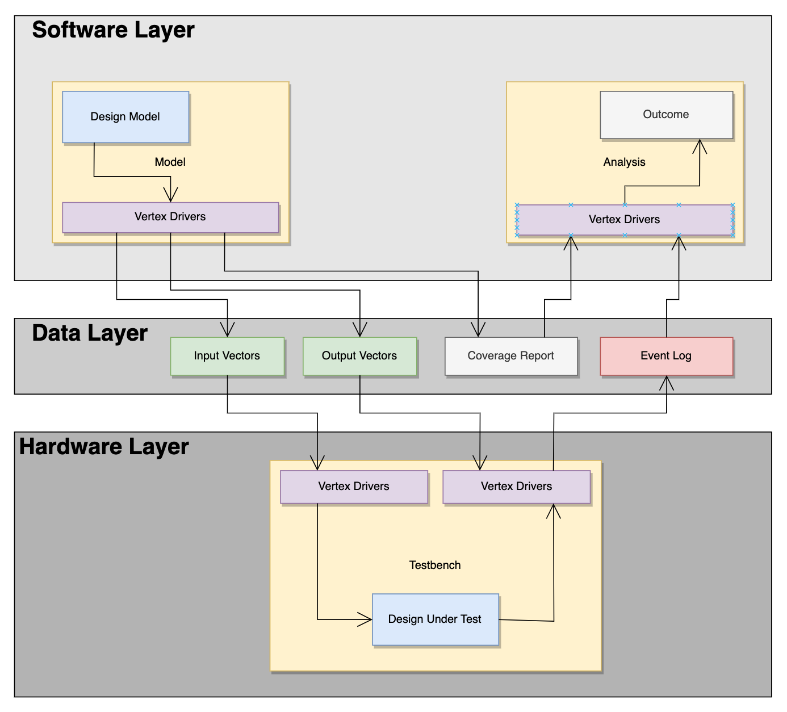

# Overview

The Verb framework is divided into three main layers.

- _Software Layer_: low-level functions to generate inputs and outputs and analyze recorded data
- _Data Layer_: persistent storage of data to be shared between hardware and software layers
- _Hardware Layer_: low-level functions to load inputs and outputs, drive inputs, check outputs, and log events

This separation of functionality is important for modularity. If a model needs to be written in a different language (Python/C++/Rust), then only the software layer requires changes; the data layer and hardware layer are left unmodified. Having well-defined interfaces between these layers allows for the framework to easily expand to new software languages and HDLs.

### Software Layer

The software layer implements the low-level functions required to run any form of test. It translates your test cases into the data layer represented by a specific file format.

The software layer is responsible for generating test inputs, tracking coverage, and generating test outputs. When defining signals in your software model, you can also specify their probability distribution to randomly sample based on distributions. If not specified, the default is uniform distribution.

The software layer can also generate HDL code, which can be directly copied into the testbench for establishing connections between the hardware design and the data layer.

The software layer is available as a library and as a stand-alone program.

### Data Layer

The data layer stores the tests to run during simulation and the expected outputs. This information is typically stored in a specific file format already handled by Verb.

Each line in a data file is a _transaction_. A transaction in this sense is the combination of complete set of inputs or outputs. For data stored in an input file, each transaction is to be the input into the design-under-test on a single clock cycle. For data stored in an output file, each transaction is the outputs to be checked against the design-under-test's outputs in the scoreboard. The output transactions do not have to be checked every clock cycle, and may only be cared when a certain condition occurs (such as a valid signal being asserted).

The number of transactions stored as inputs and outputs does not have to be 1-to-1. There may be more input transactions (fed every clock cycle) than output transactions (only checked when valid).

### Hardware Layer

The hardware drivers implement the low-level functions required to receive data from the data layer. This data is read during simulation to run test cases and automatically assert outputs.

The hardware layer is responsible for the timing of the simulation: specifically determining when to drive inputs and monitoring when to check outputs.